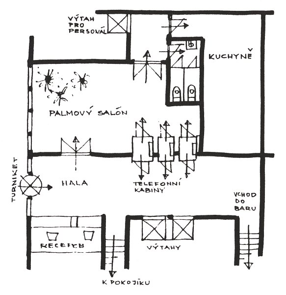
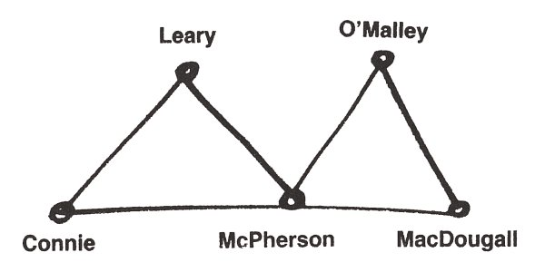
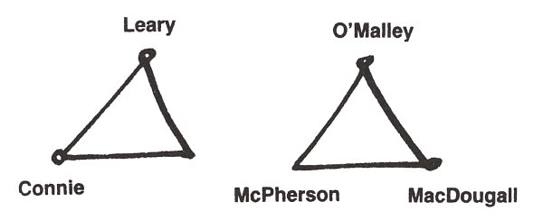
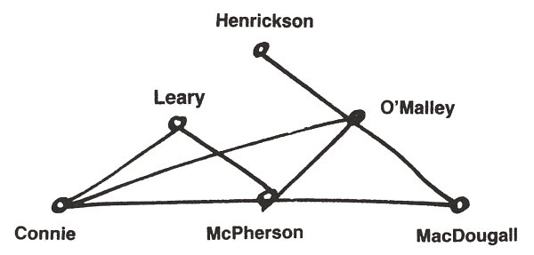
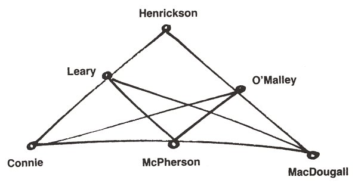
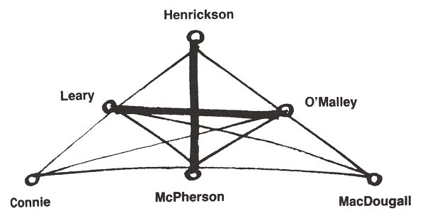
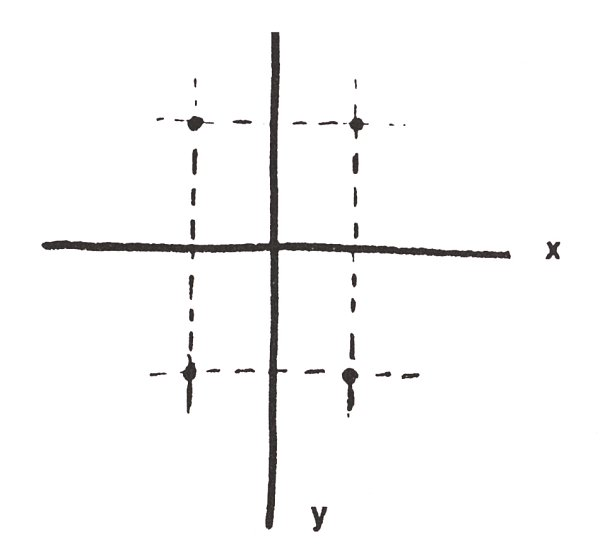
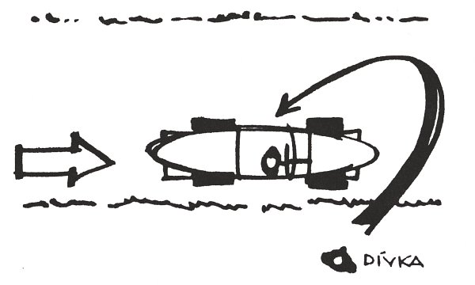

Nojo, povídám nad tím plánkem. Ale včera dopoledne byla přece Ann na simultánce. Tu závoru na předních dveřích zaklapla, když se vrátila. Houby, praví Markusek. Na žádný simultánce nebyla. To už jsem zjistil. Bill Snake tu bude co nevidět.

Než přišel, pročenichala jsem Andulin pokoj, co o něm Markusek mluvil jako o místě činu proto, že odtamtud Andulu asi unesli. V rohu stála nerozestlaná úzká postýlka, u okna, co jim bylo vidět na eukalyptovej les, širokánskej pracovní stůl, na něm hromady a hromady lejster, popsanejch pečlivou rukou, a samý číslice: číslice, na jaký jsem se matně pamatovala z biskupáku, a který pro mě, to jsem si pamatovala mnohem jasnějc, vlastně úplně spolehlivě, už tenkrát byly asi tak srozumitelný jako čínská abeceda, třebas:

  

na jednom papíře, nebo zas na druhým:

  

a za tim nějaký složitý výpočty a na konci nesrozumitelná kresbička, jaký ale, to jsem si pamatovala, kreslil melancholickej páter Šilhán, S. J., křídou na tabuli:

  

a tak dále,

  

a tak podobně, mě páter Šilhán, S. J., svejma melancholickejma očima u tabule vždycky tak ztrémoval, že z matiky si pamatuju akorát a2 + b2 = c2, a to nevím, co to je.

Tak jsem ještě chvilku vejrala na ty čísílka, když vtom dole zacinkaly nebeské sféry, utíkám tam, u dveří už je Markusek, otevře je a v nich stojí Hroznýš a blekotá, bledý jak papírovej kapesník, musíme ho za ruku odvíst do křesla, a on třesoucím se hlasem nesouvisle: Ona přece vždycky chodila přesně – tak jsem jí volal, přesně v deset pět – a na signál – smluvili jsme si takový signál, aby ji telefon jinak nerušil v práci – koktá, a já si pomyslím: Tak přece nějakej pokrok, a Hroznýš pokračuje: Pak – zahájili simultánku – ale podařilo se mi ještě jednou – odskočit k telefonu – v jedenáct patnáct, ale zase to nikdo nebral – a pak už jsem musel hrát až do jedné hodiny – a odpoledne jsem to ještě jednou zkusil – zase žádná odpověď –

Jakej to signál a copak ste dělal pak, až do půlnoci? otážu se Hroznýše přísně, a on zamumlá a zašumluje: Byl jsem – doma – pracoval jsem a tak – před šestou jsem zašel do Fakultního klubu – měl jsem tam něco přinést profesoru Wolfsheimovi – tam jsem se zdržel asi půl hodiny – pak jsem se byl – projít – Sám? přeruším ho. Sám, přikývne nejistě. A ten signál, to je tak: vytočit, jednou nechat zazvonit, položit, vytočit znovu. Smluvili jsme si jej teprve včera, koktá, ale to mě už nezajímá.

Vida, povídám si v duchu. Od jedný hodiny nemá alibi. Že by moji koupelnovou zkušenost vylepšil násilným únosem a někde v lese se neudržel a chudáka pannu Annu přitom samou vášní oddělal? Skoro se sama zardím. A co to vyděračský volání Ebenezerovi? Pokus o kamufláž? Taky už to tu bylo.

Ale houby! Cítím, jak se mě zmocňuje vášeň, ta lovecká, jako tehda s Raglánkem. Kdopak to přece prohrál na Lake Tahoe nedávno tři tácy a předevčírem zrovna tady u toho stolku tři stovky? A kohopak to detektivky natvrdo vařený zkazily už natolik, že vážně přemejšlí o tom, jak nastavit pokladní revolver tak šikovně, aby se mohla podívat dovnitř do hlavně, jak tam je připravená kulička, jen na ni vyběhnout? Chacha. A pro úplnost je tady Shad Snyders, proslulý hráč, předevčírem sice vyváz se zdravou kůží, ale kdo ví, kolik čtvrťáků naházel kdy do laketahoeskejch hazardautomatů, nemluvě už o ruletě a voku? A všichni ti tři pánove přeci věděli, že Andula bude dopoledne sama doma a kocour Markous se nevrátí dřív jak pozdě večer. Jest třeba, Evi, ověřit jejich alibi.

Propustili jsme prozatim vyděšenýho Hroznýše, Ebenezera jsme zanechali doma na modlitbách, nalodili jsme se do Markuskovýho De Luxe cadillacu a zamířili jsme do El Cerita. Cestou Markusek praví: Tak přemýšlím o tom telefonování. Teď si vzpomínám. Von ráno, zrovna když jsem vypad z koupelny, bylo tak asi devět, cinkne telefon, právě když jdu kolem něj, tak ho zvednu a nic, někdo ho právě položil. A sotva se k němu otočím zády, spustí znova, já ho znova zvednu a byl to Bill Snake, telefonoval mi bibliografický údaje o jednom článku, jak jsem ho o to prosil večer předtím. To bylo, jak povídám, asi devět. Tak kolem půl desátý jsem odjel. Zmlkl, poněvač už jsme v El Ceritu před domem Ernesta W. Fitzdalyho.

Daly právě pluje v zelenym bazénku jako mrtvola, má zavřený oči, a když je otevře, skoro se nás, mám dojem, lekne, a Marcus na něj ještě žoviálně: Koukni, Raymond, neblbni a vyval, kdes tu holku skoval? Daly však sehraje téměř profesionální výstup nechápavýho a poté se vytasí s téměř bezvadným alibi: od 9.00 byl ve své pracovně na fakultě a konzultoval s posluchači. Od 10.00 do 12.00 měl seminář na téma Pan Gawain a Zelený rytíř_,_ pak jel na lunch do restaurace Ye Olde Tavern v El Ceritu, přičemž se trochu opozdil, poněvač musel měnit pneumatiku – tady teda je v alibi malá dirka – ale pár minut před 01.00 už byl v Ye Olde Tavern, poobědval s dr. Bickleyem a byl s ním až do 03.15, pak odjel zpátky na fakultu, kde dále konzultoval s posluchači – ta konzultovací mánie mi byla taky trošku ne úplně nenápadná – ale v šest už byl na večeři ve fakultním klubu, kde potom hrál whist až do 10.30, kdy je z klubu vyhodili. Tak nám to Ernest W. popořádku všechno vypočítal, celej ten výslech se odehrával na březích zelenýho bazénku, a když odjíždíme, koukám, a Ernest W. zase noří tělo do vlažný vody plný utopenejch motýlů.

Shad Snyders neplul v bazénu, nýbrž trávil víkend prací na zahrádce. Když nám popsal svý profesorský činnosti – dopoledne strávil beze svědků doma, taky teda pěkná dirka, v poledne se nadláb s nějakým známým v klubu, kam se vrátil zas před šestou, po odpoledni cele věnovaném výuce vlasatých nadějí Ameriky – když nám to teda dost bezbarvě popsal, chtěl vědět, proč to chceme vlastně vědět. Tak mu to Markusek vyklopil a Shad povídá: To je divný. Já Andě volal, těsně než jsem šel v poledne do klubu, slíbil jsem jí nějakej údaj do její disertačky, a to ještě byla doma. Vzala to? podiví se Markousek. Vzala, povídá Shad. Byla doma.

Takže to bylo divný. Buď nás tahá za nos Shad, anebo Hroznýš. Což by Anduliný zmizení časově umisťovalo buď na dopoledne, nebo na odpoledne, a teď si vyber, když lžidetektor k dispozici nemáme, mudruje Marcus cestou do klubu, kde jsme se chtěli pro jistotu zastavit, a to, jak se ukázalo, byl výbornej nápad. Neb v knize meziměstských hovorů, založený na důvěře v gentlemanskou poctivost, našel Markusek záznam: 6 P.M. dálkový Salem, Mass. – prof. Snyders_._

A tak jsme ujížděli vlahým odpolednem zpátky na Grizzly Peak a Marcus v tom zamyšlení zapomněl vložit mi ruku, kam mi ji při jízdě cadillacem obvykle vkládá, to jest nad kolínko, trochu výš, nenosit se mini, řekla bych pod sukničku, a praví: Buďto nás teda valí Bill, nebo Snyders. Jedno se mi ale zdá jistý: únosce byl někdo z našich známejch. Svědčí o tom kromě povědomosti o mym zájezdu do Santa Barbary taky fakt, že v Anduliný seknici nejsou stopy násilí. To znamená, že s únoscem odešla dobrovolně, jelikož ho znala, nic zlého netušíc, pravil, ale taky to mohlo bejt jinak, napadlo mě. Co když, povídám, co když si třeba někam odskočila, a někdo úplně třeba neznámej ji čajznul někde venku, mimo dům? Sherlocku Holmesi, praví Marcus. Za prvé: pěšky si v Grizzly Peaku neni kam odskočit, a i kdyby to udělala, byly by domovní dveře buď otevřené, nebo zamknuté, ale nikoli, jak patrně chápeš, na závoru zevnitř. A pakli by si odskočila do města, mohla to učinit jedině automobilem, jenomže její MG je v pořádku v garáži. Zbývá možnost, že si odskočila zadníma dveřma do eukalyptů, jenomže co by tam dělala, když ona pracuje zásadně pod střechou, pobíhání racoonů a zpěv ptactva v lese ji ruší v soustředění.

A mě přesto něco napadlo. Sotva cadillac tiše vklouzl do chlívka vedle cudně černého maličkého MG, které Anka dostala k dosažení titulu Magister Artium_,_ povídám Markouskovi Promiň! a utíkám z garáže, ale venku ne dovnitř do baráčku, dveřma, který jsou přímo naproti těm do garáže, nýbrž oběhnu budovu zezadu, přeběhnu přes prašnou silnici, po který nikdo nikdy nejezdí, a zastavím se až na kraji eukalyptovýho lesa, kde právě sedí nějakej starej racoon a žmoulá ukradenýho horkýho psa.

A zírám. Přede mnou ta prašná zadní cesta, Anduliný okno kouká rovnou na les. Kdyby stál tady a hvízdnul na ni, a ona zrovna louskala svý rovnice u toho stolu, co je přímo pod oknem, krásně by ho viděla, a hupky hupky zadníma vrátkama do jeho náručí. Jenže to by asi nesměla bejt Andula, pomyslím si skepticky, ta svatá panna integrálů, vzniklá patrně bez pupíčku plastickou operací dle Mojžíše.

Anebo – vzpomenu si na toho svého jinocha, co potom, vycvičen, zbouch tu Honzlovou. Taky by ho z ničeho takovýho nikdo nepodezíral, ani Bezpečnost. Tak proč ne Andula hupky hupky – a právě zadem, kde to nikdo nezaznamená – a do lesíčka na palouček?

Přemejšlim, až se mi mezi obočím udělá ta pitomá vráska, která teda mimochodem vůbec není nějakej příznak věku, jak o mně roztrušujou některý stárnoucí krásky, ale mám ji už od narození, jak mi zmáčkli hlavičku porodnickejma kleštěma. Nojo. Vždyť řekněme, že Hroznýš kecá. A všecko se mi začíná skládat, jak tenkrát do tý židovský hvězdy. Hroznýš volal kolem devátý na signál. Jenže to vzal Markusek, tak to Hroznýš zakamufloval tím bibliografickým údajem, a Markusek pak vypad. Řekněme, že potom brnk Hroznýš znova svý milovaný, aby na simultánku nejezdila, že odpoledne zapíská před barákem, a nám namluvil, že to nezvedala. Což měl být primitivní pokus o alibi na dopoledne, který by poukazovalo na Anduliný zmizení v tu dobu, kdy Had dosud mastil, jestli to tak de říct, šachy s Bobbym Fischerem. Jenomže nemoh vědět, že dívence zavolá před polednem Shad, pokud teda Shad si ze svejch přesně stejnech, rovněž alibi na dopoledne vyžadujících důvodů nevymejšlí.

Pak mi přes to výkupný napadne telefon do Salemu. Záznam do knihy může ovšem pocházet od kterýhokoliv gentlemana. Spíš je to tedy důkaz naopak, neboť tak pitomý přece nikdo není, aby se podepisoval, je-li pachatelem těžkýho zločinu.

Loudám se domu, a najednou! Hele! Že by se Hroznýš za Andulou odpoledne nerozjel? Když to dopoledne nezdvihala, podle něj teda? Vždyť při její slavný spolehlivosti mu muselo být víc než divný, že se nedostavila? Proč by se teda nerozjel?

Pro slepičí kvoč, řeknu si v duchu, poněvač v mozkovně mi opět cvakne, a já vidím jasně ten důvod, proč Hroznýš, přece nutně postrašený tím, že se nedostavila, moh dát přednost odpoledni doma, strávenému prací, a tak: Z psychologickýho hlediska to přece mohlo mít, jestli nekecá, jenom jedinej důvod, a ten já tak děsně dobře znám, sama jsem ho svým přítelíkům mnohokrát zavdala: teda, já ho vždycky spíš jenom hrála, ale Andula by to asi myslela doopravdy. Moc často jsem se už v životě takzvaně urazila, když si některej jinoch předčasně příliš dovoloval a já usoudila, že mu trošku marný touhy neuškodí. To mi pak nějakej čas takzvaně nesměl na oči, a někteří, pokud to byli jinoši, se mi taky skutečně nějakej čas na oči neodvážili.

Vrazím teda s touto hypotézou v mozečku do obejváku, kde Ebenezer dosud klečí na modlitbách a Markusek ho vyrušuje tím, že mu vnucuje pomoc policie. No jasně. To by znamenalo, že ani Hroznýš, ani Shad nás za nohu netahají, z prostýho důvodu, že uražená Anka nebrala ne nesignály, nýbrž naopak signály, pokud se to tak celý záporně dá říct při současnym zachování srozumitelnosti, a běžím nahoru do Andulinýho budoárku a tam se vrhnu rovnou na její popsaný lejstra. A hledám a hledám to milostný psaníčko, co jí ho Hroznýš, jak se dobře pamatuju, večer před zmiznutím vsunul do ruky a utek do hvězdnatý noci, ale nikde nic. Všude samý:

 

a podobný, pro detektiva totálně nudný zajímavosti, jinak nic.

A pak si všimnu koše na papíry, toho klasickýho předmětu, a už se hrabu v zmačkanejch papírovejch koulích, co když jí napsal líbesbríf s nějakou nesmělou smělostí a cudnou superpannu Andulu to namíchlo, takže ty signály nebrala? A on se jí pak odpoledne neodvažoval na oči? Hrabu jak vylulaný kotě, ale taky jen samý vejpočty, až posléze je trpělivost odměněna. Mezi integrálama konečně to zajímavý růžový psaníčko.

Ne doslova růžový, ale obálka z nóbl ručního papíru, roztržená, a vzadu natištěná adresa William Q. Snake, 1352 Bancroft Ave., Berkeley, Cal_._ V obálce prázdno. Hrabu dál a rozhrabuju koule, až je mám všechny rozbalený, ale všude jen samá královna věd, erotika veškerá nikde žádná.

Hm – a pohlédnu zpátky na ten svinčík na stole. A něčeho si všimnu. Ano, mezi lejstrama z trhacího bloku leží jedno, formátem stejný, ale na nóbl ručním papíře. A teprv teď vidím, že má v záhlaví decentně vytištěný iniciály W. Q. S.

Nojo, ale na lejstru zase nic. Jenom krasopisně napsaná rovnice (4|x| + 2|y| – 4) · \[(|y| – 1) + |y| – 1 + |x|) = 0 a nad ní něčí rukou, zřejmě Hroznýšovou, This is the Solution, graphically expressed, Ann! A pod tím pak čísla a čísílka jinou rukou, filigránštější, asi ženskou, to zřejmě Anička hledala řešení a dospěla až k –

Řešení! Moment! Solution! Řešení. Tohle je Řešení, graficky vyjádřeno, Aničko! Graficky, zamyslím se, žádný graf tu není, takže to bude zřejmě podle Websterova slovníku v přeneseném smyslu, a v přeneseném smyslu graphically znamená názorně. Že jako ta rovnice názorně řeší nějaký problém. Nojo, jenomže jakej? Od melancholickýho pátera Šilhana, S. J., si pamatuju, že rovnice není řešení, ale k řešení. Teprve výsledek rovnice je řešení. Ale čeho?

Vtom vrznou dveře a Markusek povídá: Tak sem ho ukecal. Zavoláme na Shada chlupatý.

* * *

Nyní, milý čtenáři, nebo možná i některá mimořádná čtenářko, už víš, kdo unesl Annu Bradstreetovou. Protože víš, kdo ze tří možných pachatelů mluvil a nemluvil pravdu, a v čem, a proč. A jestliže nevíš, je Ti alespoň zcela zřejmé, kterého hříchu pro pátera Knoxe jsme se tentokrát dopustili.

Ovšem nehádat. V oblasti matematiky se to obzvlášť nehodí.

* * *

Eště s tim počkej, pravím Markuskovi, a podám mu ten nesrozumitelně vyčíslenej líbesbrífek. A mrkni na to. Co ti to řiká?

Markusek se mrkne, popovytáhne obočí, zamyslí se, příklad ho vcucne do matiky, takže na mě zapomene, sedne si na Anduliný křesílko, zmocní se Anduliný tužtičky a kontroluje to po Andule jak domácí úkol.

Pak se strašlivě zamračí a otočí se na mě: Tohle psala Anka? zeptá se. No zřejmě, povídám. Tomu věřím míň než Ebenezer paleontologii, povídá Markousek. Takovejhle příklad by si Anka nikdy nevymejšlela. Kdo řiká, že si ho vymyslela, povídám. Dal jí ho W. Q. S., Bill Snake, jestli si všimneš tištěnýho záhlaví. Vona ho jen vypočetla.

Markusek se znova zamračí a já, aby ho to zas nevcuclo, honem vykládám: Já mám takovou teorii, víš? Anička se na Billa kvůli něčemu urazila, a proto nebrala telefony. Ani na signál, teda právě ty na signál ne. Ponivač pak –

A Marcus se náhle strašně, ale strašlivě, vzhledem k tragickejm okolnostem až nepřístojně, rozchechtá, že mu špendlík z kravaty přímo vylítne a vypadne otevřeným oknem ven. Evinko! Ty seš přece jen génius! Tys na to přišla! A rovnice přitom počítá s absolutníma hodnotama, a přestos ji úplně pochopila! Trošku mě ne úplně přesně oceňuješ, milej, pravím. Že sem pochopila, to sem teda nepochopila. Co to je v závorce čtyři svislá čára ix svislá čára plus dvě svislá čára ypsilon a tak dále? To teda chápu ne úplně, ale ani trochu, víš? To povídám jako uraženě, a on mě obejme kolem ramen a povídá něžně: Evulíku, abys neřekla, dám ti malou lekci z matematiky, ani tobě vzdělání neuškodí, i když ho nepotřebuješ. Bude to, obávám se, tak trochu jako včera v Santa Barbaře, kdy jsem manželkám občanů nejvyšší příjmový kategorie, protože v Santa Barbaře bydlí málokdo jinej, vysvětloval zakřivení prostoru. A já, mírně nafouklá, se usadím na Andulinou postýlku a Markusoun vykládá jako skutečnej prófa.

Podívej, povídá. Vezměme si naši rovnici:

(4|x| + 2|y| – 4) · \[(|y| – 1) + |y| – 1 + |x|\] = 0

Nalevo je matematický výraz –

Co? povídám. Mluvíš k úplný blběnce, pravím. Mluv teda přiměřeně. Dobrá, milá blběnko, praví Markusek. Tedy: nalevo je všelijak počmárané x a y a ještě nějaký číslice, napravo nula. Nula, jak je ti známo, aspoň snad, znamená nic. – Nech mě chvilku přemejšlet, povídám, zapřemejšlím jako, a pravím: Chápu. Nula, neboli nic. Správně, a Markusek mele dál: Když za x a za y dosadíme nějaká dvě čísla, můžeme tu levou stranu celou vypočítat, a podle toho, jestli se ta levá strana rovná nule nebo ne, rozhodnout, jsou-li ta dvě čísla nebo nejsou-li v této rovnici řešením.

Solution! vydechnu. A sou?

No počkej, praví Markusek. Ještě jsem neřek, jaký dvě čísla. Ponivač čísel, který můžou bejt řešením, je třeba víc. A teprve všechny dohromady jsou v týhle speciální aplikaci týhle zajímavý rovnice řešením, který my dva tady dnes hledáme. Tak hledej, pravím, poněvač to už mě posedla ne zvědavost, já vůbec nejsem zvědavá, ale zájem, a Markusák profesoruje: Máme tu napsáno: Graficky vyjádřeno. Ne názorně? skočím mu do profesorování, on se zarazí. No taky názorně. Ale graficky, chápeš? Kývnu, aby mě vážně nezačal pokládat za blběnku, a on praví. Teda se uchýlíme ke způsobu, který názorně znázorní všechna řešení naší rovnice, v jejichž souhrnu je naše dnešní řešení. Za tím účelem nakreslíme dvě přímky, vodorovnou a svislou – a Markusík nakreslí:

  

Říká se jim osy, jestli si ještě vzpomínáš z hodin elementární geometrie, praví. Z hodin elementární geometrie si sice vzpomínám vskutku pouze na melancholické oči pátera Šilhana, S. J., avšak kývnu. Na tyto osy, pokračuje Markusek, naneseme stejně hustě stupnice délky tak, aby nula na obou osách ležela v jejich průsečíku zde, a položí prst na místo, o němž si teda zase náhodou pamatuju, že se mu říká průsečík. Přitom, praví Marcus, stupnici na svislé ose očíslujeme od průsečíku směrem nahoru a dolů, jako na teploměru, Celsiově myslím, tedy 1, 2, 3 a tak dále a –1, –2, –3 a taky tak dále. Vodorovnou osu očíslujeme tak, aby čísla od průsečíku napravo byla plus, neboli kladná, a čísla nalevo mínus, neboli záporná. Kdybych to takhle vyprávěl svým posluchačům, sice by si mysleli, že si je pletu s obecnou školou, ale – Děkuju, pravím. Z toho soudím, že vysoký školy v USA mají vysokou úroveň. U nás se na obecný učí jen až k odčítání. Proto tady asi taky tolik dětí vyjde ze školy předčasně, a sou z nich pak ty kluci, co se ani neuměj podepsat. Nic ve zlym, praví Markusek, a dávej pozor; do naší rovnice musíme dosadit dvě různý čísla, jedno za x, jedno za y. Dohodněme se, že každé takové dvojici čísel – ponivač jich můžeme dosadit celou řadu – bude odpovídat bod, neboli puntík, v rovině, vykládá, a poněvač už začínám zase téměř ne zcela chápat a on to na mně vidí, veme tužku a praví: Na vodorovné ose najdeme číslo dosazené za x a vedeme jím svislou přímku. Na svislé ose najdeme číslo dosazené za y a vedeme jím přímku vodorovnou. V průsečíku obou přímek leží onen bod, neboli puntík. Tak si třeba za x dosaďme dvě a za y pro změnu třeba mínus tři. A Marcus tužtičkou vyrobí následující obrázek.

  

Jednomu řešení, pokračuje Markusoun, odpovídá jeden bod. Jelikož jsem ti však řekl, hlavinko zmáčknutá – řekla jsem mu to o původu tý vrásky, když si jí jednou všim – že naše rovnička má celou řadu řešení, a teprve z nich dohromady vychází nám potřebné Řešení s velkým Ř, bude tomu odpovídat celá řada bodů, a ty dohromady budou tvořit graf, názorně znázorňující naši rovnici. Dřív ovšem, než tenhle graf nakreslíme, musíme se naučit vyčíslit výraz – teda tu míchanici x a y a různejch čísel, čar a znamínek na levý straně naší rovnice. Co je to tohle, a Markous napíše |x|, to asi vědět nebudeš, co, makovinko milovaná? Budu, pravím, když mi to řekneš. Proč bych neřek? otáže se Markusek, levou rukou mi rozepne knoflík na blůze, je přes ni třepnut, tak ho zas sám od sebe zapne a pravou čmárá a přitom mluví: Taková věc jako |x| se čte ‚absolutní hodnota z x‘ a je to číslo, které odpovídá přirozené představě velikosti, bez ohledu na znamínko. Tedy, řečeno pro blbounky a blběnky, absolutní hodnota kladného čísla je to samé číslo, absolutní hodnota nuly je nula, absolutní hodnota záporného čísla je kladné číslo, jež dostaneme pouhou změnou znamínka. Pro úplné subblběnky tedy názorně: například |5| = 5, neboli absolutní hodnota pěti je pět, anebo |–7| = 7, čili absolutní hodnota mínus sedmi je sedm. Takže můžeme začít, povídá a podá mi tužku, abych jako počítala. Nech si ty fóry, pravím já a tužku odmítnu. Ach, ženy! prohlásí Markusek. Dle antropologů mají mozek naprosto stejně téměř tak veliký jako muži – Hele! řeknu. No nic, praví honem Markusek. Tak teda: povšimněte si pozorně naší rovnice, Evi Adamová, a Markuselák napíše znova:

(4|x| + 2|y| – 4) · \[(|y| – 1) + |y| – 1 + |x|\] = 0

Především, pokud jsme vše pozorně prohlédli, vykládá, všimli jsme si, že nikde tu nenajdeme x nebo y samo o sobě, nýbrž všude jen |x| nebo |y|. Tato okolnost má jeden příjemný, tedy matematický důsledek. Jestliže například jedním řešením naší rovnice bude mínus tři a pět, a Markusoun napíše \[-3; 5\], budou řešením rovněž dvojice \[3; 5\], \[-3; –5\] a \[3; –5\]. A proč? Mlčím, neb jsem dutá, a Markuselák odpoví sám sobě: Protože na absolutní hodnotě se znaménko nepozná! Takže, kebulko, doufám, chápeš, že u každého bodu neboli puntíku budou řešením vlastně čtyři body a ty dostaneme pouhými změnami znaménka, neboli méně učeně řečeno zrcadlením podle os. Vezměme si náš původní příklad a nakresleme:

  

Jestliže mi nyní laskavě půjčíš zrcátko, řekl Markusek, vytáhnu tedy žádané z kapsičky na mini, rychle opucuju o zadánek a podám, a Markusek přiloží přesně na svislou osu a vznikne zrcadlením obrázek pro nechápavé:

  

Nyní Marcus tužkou vyšrafuje pravou horní čtvrtinu obrázku

  

a praví: To nám ulehčí práci, neboť stačí například najít jen tu část grafu, která odpovídá kladným číslicím, nebo nule, celkem řečeno poněkud učeněji, která odpovídá nezáporným číslicím, a která tedy leží v mnou vyšrafované oblasti, a pak ji zrcadlením přenést do zbývajících tří čtvrtin.

Maně mi bleskne hlavou, co má celá tahle abrakadabra společnýho s Andulou Bradstreetovou, kde ta nebohá duše v těle teď asi úpí, zaroubíkována a spoutána, a co asi dole kupec švýcarský na modlitbách a jako na trní, neb patrně předpokládá, že Marcus odsud volá chlupatý a ti tu co nevidět budou. Markusík ale učeně vykládá dál a na poldy nemyslí: Když tedy teď hledáme pouze nezáporné řešení, můžeme psát klidně x místo |x| a y místo |y|, což je ti, doufám, Evi, jasné. Což mi je úplně skoro jasné a mimoto spolehnu na jeho moudrost v pokoře své pitomosti, a on vede dál svou: Takže místo tý původní směsice číslic a čar máme pouze:

 (4x + 2y – 4) · \[(y – 1) + y – 1 + x\] = 0

Kdy je tato rovnice splněna? ptá se. To jest, pro blběnky: kdy se všechny ty čísla nalevo rovnají nule? Jsou tu, jak vidíme, dvě skupiny čísel v závorkách, vzájemně znásobené, neboli je to tak zvaný součin. A čeho je třeba, aby se součin dvou čísel rovnal nule? Odpovězte, Adamová!

Adamová ovšem neodpověděla. Nebyla by bývala na tak těžkou otázku odpověděla ani páteru Šilhanovi, S. J., a ten se k ní jakživ tak těsně nepřiblížil jako Markusák. Adamová tedy pouze vyvalila bulvy a Markuselák odpověděl sám: Aby součin dvou čísel byl roven nule, k tomu stačí, aby bylo rovno nule jedno z nich, kterážto podmínka je současně nutná. Naše rovnice je tedy ekvivalentní, neboli rovná, dvojici rovnic:

4x + 2y – 4 = 0

nebo

(y – 1) + y – l + x = 0

a její graf obdržíme složením grafů těchto dvou rovnic.

Mě už to nebaví, povídám. Pojď radši přemejšlet, kdo ti unes neteřinku. To já už vím, odpoví Markusák. A ty to budeš vědět taky, až najdeme řešení tohohle příkladu. Ponivač to potvrdí jednu jistou tvoji hypotézu, hlavinko nenormální, a majíce ji potvrzenu, z toho, co víme o pohybech těch tří v osudný den, snadno vydedukujeme, kdo nyní drží Andulu, ať z vášně, či z lačnosti peněz. Hleď, praví, a já se strašnou námahou se tedy ještě jednou soustředím. Pokud se týká tý první rovnice 4x + 2y – 4 = 0, mele čím dál rychleji, přijměmež zjevnou pravdu, že je to rovnice přímky. Dokazuje se to na střední škole pro obecný tvar ax + by – c = 0. Snad nám to páter Šilhán dokazoval, ale když já tenkrát vídávala jen ty jeho zřítelnice. A Markusek mele a mele dál: Přímka je určena dvěma svými body. Rovnici 4x + 2y – 4 = 0 vyhovují třeba dvojice \[1; 0\] nebo \[0; 2\], protože: (4 · 1) + (2 · 0) – 4 = 0, neboť 4 + 0 – 4 = 0. Anebo: (4 · 0) + (2 · 2) – 4 = 0 neboť: 0 + 4 – 4 = 0.

A příslušná přímka vypadá, jak chápeš – a já málem skoro téměř chápu – takhle:

  

My – a Markuseles vztyčí poučně prst – se však omezíme pouze na silně vytaženou úsečku: úsečka je co? Useknutá přímka, pravím pohotově, na dvou stranách useknutá, teda. Ano, Marcus silně vytáhne úsečku, useknutou oběma osama. A proč se na ni omezíme? Protože, praví tentokráte – pro mé mlčení – sám, protože odpovídá nezáporným hodnotám, jak jsme chtěli. Zbytek přímky splňuje sice rovnici 4x + 2y – 4 = 0, ale nesplňuje rovnici 4 |x| + 2 |y| – 4 = 0. To už, hloupěnko, asi nechápeš, ale ono je to stejně pro naše řešení irelevantní. Jsem hloupěnka, pravím, aspoň co se matiky týče, a tak pro mě vůbec žádný řešení není v dohledu. Hned bude, ušklíbne se Markusilík. Ještě nám ale zbývá ta druhá rovnice, (y – 1) + y – 1 + x = 0. Ta ti otevře – a otevřou se dveře a kupec švýcarský vejde dovnitř a otáže se: Kdy můžeme čekat příchod policie? Uvažoval jsem, a došel jsem k názoru, nebylo-li by přece jen lépe – Klid, švagře, osloví ho Markusek. Já jsem chlupatý ještě nevolal, poněvadž tady slečna Adamová je agentka FBI, povídá, kouknu na něj překvapeně, a vzápětí pochopím. To v tom pajzlu totiž, švagře, to je jenom naoko, pokračuje Markusoun. Slečna Adamová není žádná noční bludička, nebo eventuálně něco ještě horšího. Je to patrně nejschopnější agentka federálního homicide bureau a v tom pajzlu je kvůli jedný žhavý stopě na jednoho slavnýho mezinárodního gangstera, jehož jméno zamlčím kvůli utajení, a tvář kupce švýcarského se mění téměř ve směru lidskosti a jeho vybledlé oko o mě poprvé po drahném čase opět zavadí. Jeden významnej hack-writer, balamutí kupce švýcarského Markusek dál, velice významný námezdný spisovatel už o ní píše knihu a já se vsadím, Markusík vloží ruku na švagrovo rameno, že případ Anny Bradstreetový bude v té knize jednou nikoli z nejbezvýznamnějších kapitol… Mám tomu rozumět? začne kupec švýcarský málem dojatě, a Markusek praví: Ano, slečna seržant Adamová už objasnila případ toho únosu, a než slunce zapadne, švagře, znovu obejmeš svou dceru, pokud s potomkem ženského pohlaví takové věci vůbec děláš, praví Marcus, ale kupec švýcarský v otcovském žalu nepochopí narážku. Zbývá dokončit malý výpočet, řekne Markusoun a vezme do ruky tužku. Kde jsme to zůstali? U tý rovnice, co už jí nerozumim, povídám. A začals právě o tý druhý (y – 1) + y – 1 + x = 0. Aha, vzpomene si Marcus. Zde si tedy povšimněme chování výrazu (y – 1) + y – 1. Ten, jak je zcela evidentní, se rovná nule, když (y – 1) je záporné nebo nula, a je roven číslu 2 (y – 1), a tedy je kladný, je-li y – 1 kladné. Strašně si namůžu mozek, všimnu si, že oči kupce švýcarského na mně spočívají už málem s obdivem a téměř omlouvají mou minisukni, považujíce ji patrně za služební přestrojení. A strašně na mozku namožená, ale úspěšně, pravím: Rozumím. Jsem skoro nakloněn ne úplně ti naprosto věřit, zaopičí se Markusíček po mém oblíbeném úsloví. Nicméně pokračujme. Výraz (y – 1) + y – 1 je tudíž vždy nezáporný, nule se rovná jen pro (y – 1) záporné nebo nulové. Když jsme začali kreslit náš graf, a Markusek ukáže na obrázek

  

a pokračuje, omezili jsme se na x a rovněž na y nezáporná; součet (y – l) + y – l + x bude se tedy, za našeho omezení, rovnat nule jen tehdy, bude-li současně x rovno nule, bude-li y nezáporné a (y – 1) záporné nebo nulové. Graficky znázorněno může pro naši rovnici y být něco mezi nulou a jednotkou, přičemž může nabývat i extrémních hodnot. Jakých? otážu se a Markusek honem: Těchto extrémních hodnot, to jest nuly a jedničky. A nyní, praví slavnostně a vezme čistý list, nyní jsme již bezprostředně před řešením, jež pro nás bude Řešením s velkým Ř. Uchopí špačka, okousanýho zřejmě Andulou v nějakým exponenciálním orgasmu, praví a současně kreslí: Příslušný graf téhle rovnice je tedy svislá úsečka, pnoucí se po ose y, s krajními body \[0; 0\] a \[0; 1\]. Tedy tahle:

  

Takže, protože všechny ostatní podezřelé tahle přímka vylučuje, ušklíbne se Markous pekelně, půjdeme pro kolegu Dalyho, ne?

Koukám na tu věc, Marcus ještě silně vytahuje tu jeden palec dlouhou úsečku, mám dojem, že tím nezdravým přemejšlením mi začíná měknout mozek. Počkej, milouši, povídám. To teda ale fakt nevím proč? Ne že by podle vší běžný dedukce nebyl Daly zatraceně podezřelej. Ale jak můžeš říct, Markousi, že ty dva druhý, který sou teda voba taky pěkný kvítka, tohle vylučuje?

Jen přemejšlej, praví cynicky Markusák, a kupec švýcarský se zvedne, přistoupí ke stolu, a čučí mi svíčkovým zrakem přes rameno na naše rovnice. Přemejšlej, pobízí mě Markuselák. Copak to napsal Bill Pokušitel Svaté Aničce do záhlaví tohohle příkladu? Copak to? Rozhrábnu hromádku, co se mezitím udělala na stole, najdu ten list. This is the Solution, graphically expressed, Ann! najdu tam Hroznýšovou rukou. Tohle je názorné řešení, Aničko. Ale čeho? Únosu?

Kupec švýcarský za mnou zabručí, veme okousanýho špačka, odkašle si, a já si uvědomuju, že on je vlastně taky matik, i když biblickej, a praví, jako by, zdá se mi, spíš pro mě než pro sebe: Každé řešení této rovnice, a ukáže ponuře na 4 |x| + 2 |y| – 4 = 0 je vlastně čtveřicí řešení. Tedy: \[1; 2\], \[-1; –2\], \[-1; 2\], \[1; –2\]. Řešení rovnice (|y| – 1) + |y| –1 + |x| = 0 bude toliko dvojí, a to: \[0; 1\] a \[0; –1\]. Graficky znázorněno – a protože obě ty rovnice jsou součástí původní rovnice

(4 |x| + 2 |y| – 4) · \[(|y| – 1) + |y| –1 + |x|\] = 0,

můžeme je vkreslit ne do dvou, ale do jediného grafu – graficky tedy znázorněno bude to vyhlížet přibližně takto:

  

Pak se kupec švýcarský spokojeně zadívá na to, co nakreslil, a nemylí-li mě odhad Markuselákovy fyziognomie, a ten mě málokdy mýlí a tentokrát určitě ne, převezme výklad s ďábelsky chlípným úsměvem: Jestli pamatuješ, Evíku, na začátku jsem ti řek, že fakt čtverého řešení rovnice nám umožní celou čtveřici dostat nikoli pracným kreslením, nýbrž prostým zrcadlením podle os, a protože čtvrtku grafu už nám švagr nakreslil, tedy postačí už pouze zrcadlení. Podle osy x a současně podle osy y. Puč mi, prosim tě, eště jednou to zrcátko. Což učiním, načež Markuselák praselák ho postaví kolmo na graf kupce švýcarského podél osy ypsilon, a to tak, že roh mýho zrcátka je přesně v průsečíku os ix a ypsilon. Co nakreslil kupec napravo od osy ypsilon, zrcadlí se nyní i nalevo. Načež se Markuseles rozhlídne, zaznamená panenský obdélníkový zrcátko na Andulině nočním stolku, zakoupený zřejmě v salemský prodejně, protože ani nemá nějakej rantl s umělým rytim jako to moje, a Markuselík ho drapne a přiloží podél osy x, podél celý její délky napravo i nalevo vod osy ypsilon, takže vznikne něco na způsob petřínskýho bludiště, ale jak na to koukám, vidím, že docela jasně vznik taky jistej geometrickej obrazec z lidovýho zadunajskýho folklóru, mně sice údajně neznámej, ovšem ve skutečnosti naopak. A v hlavince mi blikne, protože teda týhle geometrii rozumim líp než profesor Marcus, a pravím rozhořčeně: Ten praselák! Čímž se sice přiznám k někdejší lži, ale Markusek to přehlídne. Tak dem! vyskočim. Pro FBI? otáže se kupec švýcarský. Nikoli, pravím. Pro Ernesta W. F. R. Dalyho. A s nim pak pro vaší céru. A v hlavince mi znova naskočí ten výjev, tenkrát dávno, teda skoro bezmála úplně jenom několik málo let, při mym věku to ani nemůže bejt doopravdy dávno, jak jinoch v dvouřadovym saku s mravnou puntíkovou kravatou se vrh pod tekoucí sprchu. Hroznýš se sice pod sprchu nevrh, ale rovněž to, i když mnohem intelektuálnějc než ten muj jinoch, nevydržel. A houby Lubomíra, uvědomim si, vylepšila význam toho lidovýho symbolu. Žádná Lubomíra! Ta děvka to Aničce naservírovala bez fantazie, úplně realisticky, co ten rhombus znamená, proto z toho byl ten šok! Vylepšení pocházelo zřejmě od tý dívky, co přišla na svět asi uměle. Někdo jí něco řek o srdíčkách z marcipánu, tak z toho dala dohromady přijatelnou verzi pro svou matici, a od ní se pak ta uslušněná, nicméně stále pro Matherovy fundamentalisty pohoršlivá verze roznesla po Markuselákově rodině, a z ní pronikla i k sluchu Hroznýše královskýho. Ubohej jinošek! vzdychnu. Chtěl použít starýho, krásnýho zadunajskýho folklórního způsobu, jak navrhnout dívce zasnoubení, a dívka, poučená bez jeho vědomí potvorou Lubomírou, ale už asi zapomněvší na vlastní zdecentnění Lubomířinýho výkladu, se urazila tak, že možná i omdlela v novym šoku – že každopádně nebrala telefony, i když cinkaly ten jejich signál. Chudák jinoch! pomyslím si, a Markusele se zubí, ovšem rovněž netuší hloubku nemravnosti toho vypočítanýho kosočtverce a myslí jenom, že pouhá narážka na něco souvisejícího s jinou než umělou výrobou dětí stačila, aby Anna podlehla šoku. Kupec švýcarský zamračeně hledí na to, co nakreslil, pak téměř štítivě veme do ruky můj ukoptěnej nástroj světský marnosti a přiloží jej podél osy ypsilon, počínaje od průsečíku obou os nahoru, kresba se zazrcadlí a kupec švýcarský veme, méně štítivě, do ruky zrcátko svý dcery a přiloží podél celý délky osy ix, ještě víc se zamračí, zavrtí hlavou a praví: Rhombus, omezený body plus jedna plus dvě méně jedna méně dvě – vraští obočí, vrtí hlavou, prohlásí: Nechápu. Je toho zde snad použito jako nějakého smluveného znaku? Zřejmě už na Švýcarsko zapomněl.

\* \* \*

Nechali jsme kupce švýcarského nad jeho bodama omezenym rhombusem a zajeli jsme opět až do El Cerita za plavcem v zelenym bazénu. Už neplaval. Zdrcen trémou psal právě na elektrickém Smith-Corona portejblu přiznání, revolver jako z Hammetta vedle sebe na stole, kdoví kde ho sebral, a když jsme bez zaklepání vstoupili, chtěl ho použít. Ne na nás. Na sebe. Markusák, jako kdyby ty tvrdý detektivky hltal on, a ne Ernest W., mu ho vyrazil z ruky, takže letěl krásným obloukem rovnou do otevřený láhve s medem vedle v kuchyni na mycím stole, čímž se značně znehodnotil. Poté jsme ještě dojeli pro Andulu, ležela omdlelá v lesní chatě jednoho Dalyho posluchače, taky fandy drsný školy, kterýmu Ernest W. navíc za pomoc při tom únosu slíbil napsat disertačku, kterou by pak sám posuzoval. Markusík celou věc vyřešil tím, že Ernestu W. dal přes hubu a jeho strachem téměř taky omdlelýho komplice donutil, že mu tu chatu pak půjčoval jako abštajg pro avantůry s posluchačkama matematiky, ale to já už v Berkeley nebyla, to by si za mě nedovolil, psal mi o tom pak jeho asistent. Chlupatý se o tom teda vůbec nedozvěděli a Shadovi a Hroznýšovi se to prezentovalo jako kanadskej žertík.

A tak jsme tehdy naložili vzkříšenou Andulu, oba zločince jsme nechali, ať se škvaří v nejistotách, cestou jsme se pro jistotu stavili ještě pro ten levák utopenej v medu a dorazili jsme na 1275 Grizzly Drive akorát včas k rodinný večeři. Shledání dcery s otcem bylo dojemný, dokonce jí vtiskl polibek na čelo. Pozdě večer se pod okno připlížil Hroznýš, zíral, poté se odvážil ke dveřím, ale protože Andula ho tím oknem zmerčila, pošeptala něco kupci švýcarskému, ten rázně vykročil k hlavnímu vchodu, a právě když zazněla hudba sfér, otevřel veřeje, popadl Hroznýše za límec a fundamentalistickým kopnutím ho poslal vzduchem až na vozovku Grizzly Drive. Když se pak druhý den loučil, mručivě prohlásil, že je mi do smrti zavázán vděčností, a mimoto se mi bude revanšovat, což neučinil.

\* \* \*

Po pravdě řečeno, tohle mě na Markuseláka mrzí vlastně víc, než že mě nakonec nechal s jednou čínskou studentkou teorie rozmnožování, nějakou Priscillou Fu. Pěkná peleš neřesti, ten 1275 Grizzly Drive! Ten kupeckej kopanec měl tenkrát na Hroznýše účinky stejně blahodárný jako sprcha na mýho jinocha v případě tý Jany Honzlový, akorát že Anička Bradstreetová si pomoct dát nechtěla. Ještě než jsem odjela z Berkeley, pokusil se Hroznýš uprchnout do Austrálie. Avšak kupec švýcarský podruhé v životě nasedl do letadla, oblétl půl světa a přivlekl Hroznýše za límec až z dalekého Brisbane. A svatba byla slavná, úplně fundamentální, jedině bez bílýho věnečku. Vyznavači Cottona Mathera za žádnejch okolností nelžou.

Todle jsem ovšem nemyslela, když jsem mluvila o neřesti. Na svatbu jsem přišla ve svym novym minkovym kožiše, kterej mi dal Markuselák, už když věděl, že mi zahne s tou šikmovokou, teda vlastně jako náplast na bébé, a neustále přitom naříkal, jak se kvůli mně plácnul přes kapsu, za což přirozeně dostal bohatou odměnu. A na té svatbě Andula, trapně světská, už jsem si tak zvykla na její svatý chování, že mi to připadalo teď málem nemravný, prstejčkama zajede do minkový srsti a praví: To je nádhera! To sis pořídila za těch deset táců? Za jakejch deset táců? tážu se. No, Andula se trošku zarazí, asi se o tom nemá mluvit, ale vždyť je to skoro jako v rodině, praví málem hříšně. Za těch deset táců, co ti jako projev vděčnosti poslal táta po strýci Marcusovi, aby tě jako neurazil, kdyby ti to dal sám, a FBI by to taky mohlo považovat za úplatek, tak abys ještě za všechno, cos pro mě udělala, neměla nějaké nepříjemnosti.

Tak jsem ten večer ztropila Markouskovi scénu, která obávám se, uspíšila to s tou z Hong Kongu. Ten minkovej kožich stál sotva šest. Takovou nemravnost jsem od něj teda fakticky nečekala, jakej byl praselák.
